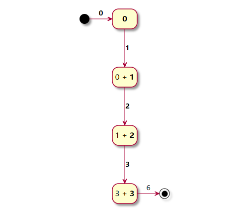
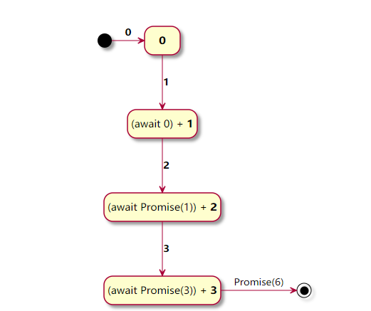
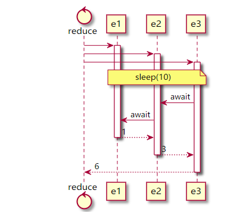
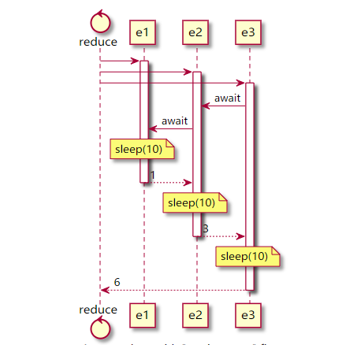

# 在 Array.reduce 中正确使用 async


> 如何使用带有reduce的Promise以及如何在串行和并行处理之间进行选择 
>
> 本文译自[How to use async functions with Array.reduce in Javascript -  **Tamás Sallai** ](https://advancedweb.hu/how-to-use-async-functions-with-array-reduce-in-javascript/)。 

 在[第一篇文章中](https://advancedweb.hu/asynchronous-array-functions-in-javascript/)，我们介绍了async / await 如何帮助执行异步命令，但在异步处理集合时却无济于事。在本文中，我们将研究`reduce`函数，它是功能最丰富的集合函数，因为它可以模拟所有其他函数。

## 1.  Array.reduce

Reduce迭代地构造一个值并返回它，它不一定是一个集合。这就是名字的来源，因为它减少了收集到的值。

迭代函数获取先前的结果（ `memo `在下面的示例中调用）以及当前值`e`。

以下函数对元素进行求和，从0开始（第二个参数`reduce`）：

```javascript
const arr = [1, 2, 3];

const syncRes = arr.reduce((memo, e) => {
	return memo + e;
}, 0);

console.log(syncRes);
// 6
```

|   memo    |  e   |     结果      |
| :-------: | :--: | :-----------: |
| 0（初始） | 1个  |      1个      |
|    1个    |  2   |       3       |
|     3     |  3   | （最终结果）6 |

 



## 2.  异步 `reduce`

异步版本几乎相同，但每次迭代都会返回一个Promise，因此 `memo` 将是先前结果的Promise。迭代函数需要 `await` 它才能计算下一个结果：

```javascript
// utility function for sleeping
const sleep = (n) => new Promise((res) => setTimeout(res, n));

const arr = [1, 2, 3];

const asyncRes = await arr.reduce(async (memo, e) => {
	await sleep(10);
	return (await memo) + e;
}, 0);

console.log(asyncRes);
// 6
```

|    memo     |  e   |          结果           |
| :---------: | :--: | :---------------------: |
|  0（初始）  |  1   |       Promise (1)       |
| Promise (1) |  2   |       Promise (3)       |
| Promise (3) |  3   | （最终结果）Promise (6) |

 




使用的结构`async (memo, e) => await memo`，`reduce`可以处理任何异步功能，并且可以对其进行`await`编辑。


## 3.  定时

当在 `reduce` 中并发时有一个有趣的属性。在同步版本中，元素被一对一处理，这并不奇怪，因为它们依赖于先前的结果。但是，当异步 `reduce` 运行时，所有迭代函数将开始并行运行，`await memo`仅在需要时才等待上一个结果。

### 3.1  await memo last

在上面的示例中，所有 `sleep` 并行执行 ，因为`await memo`使得函数等待上一个函数完成后执行。

```javascript
const arr = [1, 2, 3];

const startTime = new Date().getTime();

const asyncRes = await arr.reduce(async (memo, e) => {
	await sleep(10);
	return (await memo) + e;
}, 0);

console.log(`Took ${new Date().getTime() - startTime} ms`);
// Took 11-13 ms
```




### 3.2  await memo first

但是当`await memo`最先出现时，这些函数按顺序运行：

```javascript
const arr = [1, 2, 3];

const startTime = new Date().getTime();

const asyncRes = await arr.reduce(async (memo, e) => {
	await memo;
	await sleep(10);
	return (await memo) + e;
}, 0);

console.log(`Took ${new Date().getTime() - startTime} ms`);
// Took 36-38 ms
```




这种行为通常不是问题，这意味着不依赖于先前结果的所有内容都将立即被计算出来，只有依赖部分正在等待先前的值。

### 3.3  当并行很重要时

但是在某些情况下，提前做一些事情可能是不可行的。

例如，我有一段代码可以打印不同的PDF，并使用 `pdf-lib` 库将它们拼接到一个文件中。

实现 `printPDF` 并行运行资源密集型功能：

```javascript
const result = await printingPages.reduce(async (memo, page) => {
	const pdf = await PDFDocument.load(await printPDF(page));

	const pdfDoc = await memo;

	(await pdfDoc.copyPages(pdf, pdf.getPageIndices()))
		.forEach((page) => pdfDoc.addPage(page));

	return pdfDoc;

}, PDFDocument.create());
```

我注意到当我有很多页面要打印时，它将占用过多的内存并减慢整个过程。

一个简单的更改，使 `printPDF` 调用等待上一个调用完成：

```javascript
const result = await printingPages.reduce(async (memo, page) => {
	const pdfDoc = await memo;

	const pdf = await PDFDocument.load(await printPDF(page));

	(await pdfDoc.copyPages(pdf, pdf.getPageIndices()))
		.forEach((page) => pdfDoc.addPage(page));

	return pdfDoc;

}, PDFDocument.create());
```


## 4.  结论

`reduce` 函数很容易转换为异步函数，但是要弄清楚并行性可能很棘手。幸运的是，它很少破坏任何东西，但是在一些资源密集型或速率受限的操作中，了解如何调用函数至关重要。


#### 推荐阅读

- [如何在 Array.forEach 中正确使用 Async](https://mp.weixin.qq.com/s/39J2KO8h_cBKg3MWB63L7w)

- [如何在 Array.filter 中正确使用 Async](https://mp.weixin.qq.com/s/OtFsaLb2a26D0Uz4aFaoAw)

